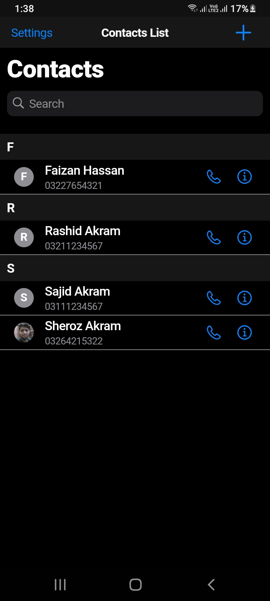
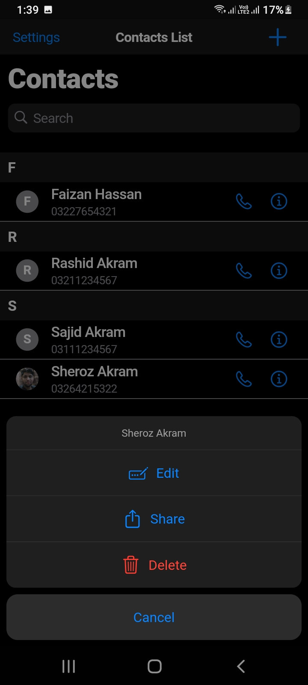
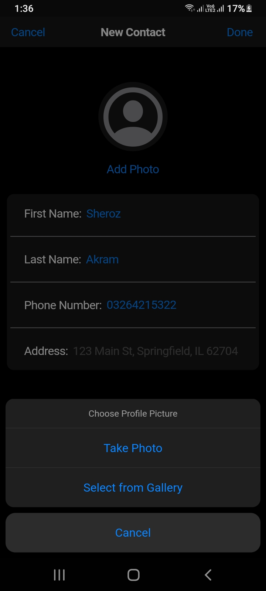
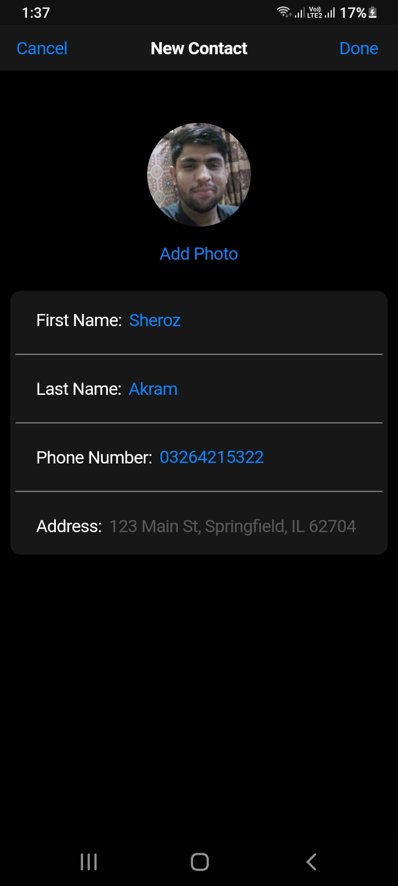
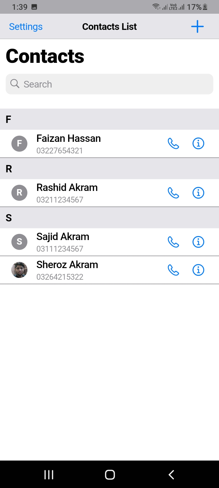
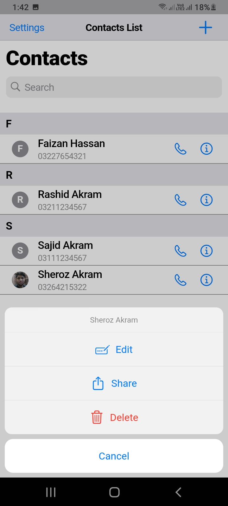
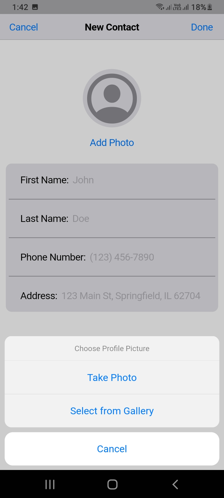
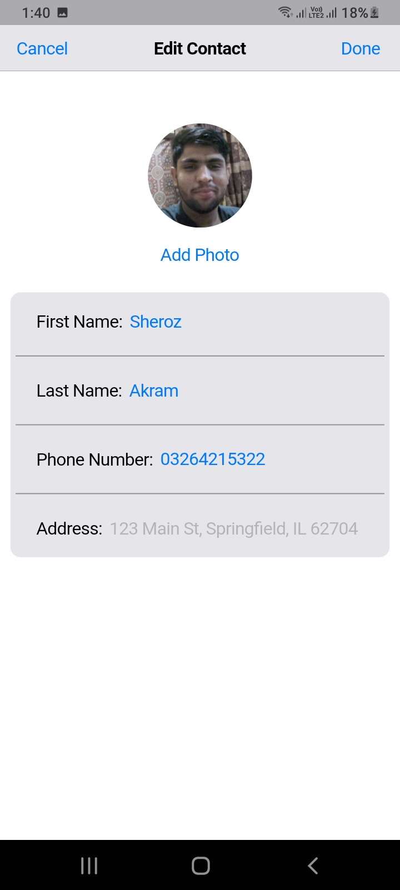
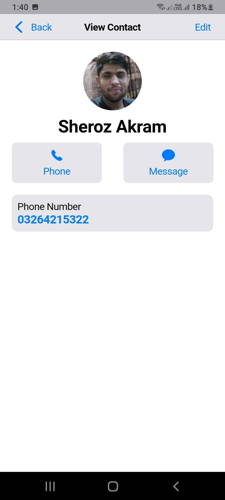

# Contact Book Application
The Contact Book Application is a user-friendly mobile app designed to efficiently store and manage contact details such as phone numbers and profile pictures, all associated with individual names. The app is inspired by the sleek and intuitive iOS design theme, ensuring a smooth and visually appealing user experience.

## Features
- **Store Contact Details:** Save and manage multiple contact details, including phone numbers and address
- **Profile Pictures:** Add profile pictures to each contact for easy visual identification.
- **iOS-Inspired Design:** Enjoy a clean, modern interface inspired by iOS design principles, providing a familiar and intuitive user experience.
Search and Filter: Quickly search for contacts and filter results by name or other criteria.
- **Organized View:** View contacts in an organized, alphabetical list with headers indicating the first character of each group.
- **Dark Mode Support:** Seamlessly switch between light and dark modes to match your system settings or personal preference.
- **Import and Export:** Easily import contacts from existing lists or export your contacts to other devices or services.

## Screenshots

### Dark Mode
    

### Light Mode
    
